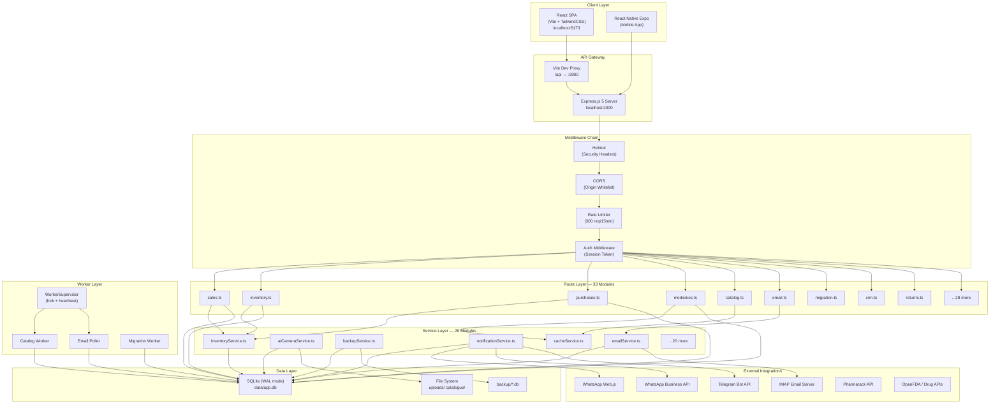

# 🏗️ Architecture Overview

---

## System Architecture Diagram



---

## Layer Responsibilities

### Client Layer
- **React SPA (Vite)** — Desktop browser UI on `localhost:5173`. Uses TailwindCSS with semantic theme variables (`bg-bg`, `text-text`, etc.). Communicates with backend via Vite proxy.
- **React Native Expo** — Mobile app for offline sales/purchases. Syncs data to desktop when connected.

### API Gateway
- **Vite Dev Proxy** — In development, proxies `/api` and `/uploads` requests from `:5173` to `:3000`.
- **Express.js 5 Server** — Main HTTP server on `:3000`. Mounts 33 route modules under `/api/`.

### Middleware Chain (executed in order)
1. **Helmet** — Sets security headers (CSP disabled for inline scripts)
2. **CORS** — Whitelists `localhost:5173`, `localhost:3000`, `127.0.0.1` variants
3. **Rate Limiter** — 300 requests per 15-minute window per IP
4. **JSON Body Parser** — 15MB limit for large catalog imports
5. **Activity Tracker** — Records user activity timestamps (ignores background polling)
6. **Auth Middleware** — Session token validation (skipped in dev mode)

### Route Layer (33 modules)
Each route file is an Express Router handling CRUD + business operations for a domain:

| Route File | Mount Path | Responsibility |
|-----------|------------|----------------|
| `sales.ts` | `/api/sales` | POS transactions, invoice CRUD, bill hold/restore |
| `inventory.ts` | `/api/inventory` | Stock management, medicine search, catalog search |
| `purchases.ts` | `/api/purchases` | Purchase bills, reconciliation, price history |
| `medicines.ts` | `/api/medicines` | Medicine master CRUD, bulk delete |
| `catalog.ts` | `/api/catalog` | Catalog import pipeline, job management |
| `migration.ts` | `/api/migration` | Legacy data migration, staging tables |
| `email.ts` | `/api/email` | Email inbox, attachment parsing, sync |
| `crm.ts` | `/api/crm` | Patient/doctor management, history |
| `returns.ts` | `/api/returns` | Supplier returns, near-expiry scanning |
| `customerReturns.ts` | `/api/customer-returns` | Customer return processing |
| `orders.ts` | `/api/orders` | Special orders & requests |
| `expiry.ts` | `/api/expiry` | Expiry monitoring & alerts |
| `dispatch.ts` | `/api/dispatch` | Delivery orders & delivery boys |
| `pharmarack.ts` | `/api/pharmarack` | Pharmarack search & cart |
| `messaging.ts` | `/api/messaging` | WhatsApp personal client |
| `whatsappBusiness.ts` | `/api/wa-business` | WhatsApp Business API webhooks |
| `settings.ts` | `/api/settings` | App configuration |
| `reports.ts` | `/api/reports` | Business reports |
| `compliance.ts` | `/api/compliance` | Drug compliance logs |
| `notifications.ts` | `/api/notifications` | SSE stream, device registry |
| `dashboard.ts` | `/api/dashboard` | Dashboard stats & alerts |
| `learning.ts` | `/api/learning` | AI document understanding |
| `archive.ts` | `/api/archive` | Image/document archive |
| `enrichment.ts` | `/api/enrichment` | Composition enrichment queue |
| `upload.ts` | `/api/upload` | File upload handler (multer) |
| `distributors.ts` | `/api/distributors` | Distributor master data |
| `license.ts` | `/api/license` | License activation |
| `security.ts` | `/api/security` | Security endpoints |
| `aiCamera.ts` | `/api/aicamera` | AI Camera OCR |
| `telegramPrescription.ts` | `/api/telegram-prescription` | Telegram prescription processing |
| `refills.ts` | `/api/refills` | Patient refill management |
| `creditNotes.ts` | `/api/credit-notes` | Credit note reconciliation |
| `utilities.ts` | `/api/utilities` | Barcode generation, tools |

### Service Layer (26 modules)
Business logic separated from HTTP handling:

| Service | Size | Responsibility |
|---------|------|----------------|
| `emailService.ts` | 121 KB | IMAP integration, attachment parsing, distributor matching |
| `aiCameraService.ts` | 12 KB | Tesseract.js + ONNX PaddleOCR engine |
| `backupService.ts` | 7 KB | DB backup/restore, retention, scheduling |
| `notificationService.ts` | 6 KB | Multi-channel notification router |
| `inventoryService.ts` | 7 KB | Stock calculations, deductions |
| `cacheService.ts` | 2 KB | SQLite-backed enrichment cache |
| `productNameFilterService.ts` | 17 KB | Medicine name fuzzy matching |
| `whatsappBusinessService.ts` | 12 KB | Official WhatsApp API client |
| `telegramPrescriptionService.ts` | 12 KB | Telegram photo OCR processing |
| `invoiceService.ts` | 11 KB | PDF invoice generation |
| `pdfInvoiceService.ts` | 8 KB | Styled PDF invoice creation |
| `creditNoteService.ts` | 4 KB | Credit note tracking |
| `customerService.ts` | 5 KB | Patient management |
| `medicineService.ts` | 7 KB | Medicine CRUD operations |
| `refillService.ts` | 5 KB | Refill scheduling logic |
| `expiryAlertService.ts` | 6 KB | Near-expiry scanning |
| `nonMovingReportService.ts` | 8 KB | Dead stock analysis |
| `imageArchiveService.ts` | 7 KB | Document image storage |
| `onlineDataEnricher.ts` | 3 KB | Online API enrichment |
| `whatsappQueue.ts` | 4 KB | Persistent send queue |
| `whatsappInvoiceService.ts` | 5 KB | Invoice delivery via WhatsApp |
| `pushNotificationService.ts` | 5 KB | Push notification delivery |
| `dataMerger.ts` | 2 KB | Data merge utilities |
| `eventService.ts` | 1 KB | Internal event bus |
| `nNotificationService.ts` | 5 KB | Native notification service |
| `onnxOcrService.ts` | 6 KB | ONNX Runtime OCR |

### Worker Layer
Background processes managed by the WorkerSupervisor:

| Worker | Size | Process | Responsibility |
|--------|------|---------|----------------|
| `catalogWorker.ts` | 34 KB | Forked child | Catalog file parsing & medicine import |
| `migrationWorker.ts` | 66 KB | Forked child | Legacy data migration processing |
| `emailPoller.ts` | 1 KB | Forked child | Periodic email inbox polling |
| `workerSupervisor.ts` | 5 KB | Main process | Heartbeat monitoring, auto-restart |

### Data Layer
- **SQLite** — Single `data/app.db` file, WAL journal mode, 30+ tables
- **File System** — `uploads/` for file uploads, `catalogue/raw/` for catalog files
- **Backup** — `backup/` directory with retention (max 20 backups)

---

## Complete File Structure

```
AI PHARMACY/
├── src/                          # Backend (Express.js + TypeScript)
│   ├── server.ts                 # Entry point — Express app, middleware, cron jobs
│   ├── database.ts               # Schema definition (~568 lines, 30+ tables)
│   ├── database/
│   │   ├── connection.ts         # Singleton DatabaseManager (better-sqlite3)
│   │   ├── sqlitePatch.ts        # SQLite compatibility fixes
│   │   ├── messageDAO.ts         # Message data access
│   │   └── migrations/           # Schema migration scripts
│   ├── routes/                   # 33 API route modules
│   ├── services/                 # 26 business logic services
│   ├── worker/                   # Background processing
│   │   ├── workerSupervisor.ts   # Process supervisor (fork/heartbeat/restart)
│   │   ├── catalogWorker.ts      # Catalog file processing worker
│   │   ├── migrationWorker.ts    # Legacy data migration worker
│   │   ├── emailPoller.ts        # Periodic email check worker
│   │   ├── parsers/              # Data format parsers (4 files)
│   │   └── importers/            # Database importers (4 files)
│   ├── middleware/               # Express middleware (6 files)
│   ├── config/index.ts           # Environment configuration
│   ├── utils/                    # Utility modules (7 files)
│   ├── extractor.ts              # PDF/CSV data extractor with OCR fallback
│   ├── telegramBot.ts            # Telegram bot service
│   └── whatsappClient.ts         # WhatsApp Web.js client
│
├── frontend/                     # Frontend (React + Vite + TailwindCSS)
│   ├── src/
│   │   ├── App.tsx               # Main app (1182 lines)
│   │   ├── main.tsx              # React DOM entry
│   │   ├── pages/                # 24 page components
│   │   ├── components/           # 8 shared components
│   │   ├── services/
│   │   │   ├── api.ts            # Axios client + all API methods
│   │   │   └── events.ts         # Custom event bus
│   │   └── index.css             # Design system (25KB)
│   └── vite.config.ts            # Vite config with API proxy
│
├── pharmacy-mobile/              # Mobile App (React Native + Expo)
│   ├── app/                      # Expo Router pages
│   ├── components/               # Mobile UI components
│   ├── lib/                      # Mobile utilities
│   └── constants/                # Theme & config
│
├── data/app.db                   # SQLite database (single file)
├── backup/                       # Automated backup storage
├── uploads/                      # File uploads & temp processing
├── catalogue/raw/                # Raw catalog files for processing
├── tests/                        # Jest test suite (18 test files)
└── scripts/                      # CLI tools & knowledge graph
```
