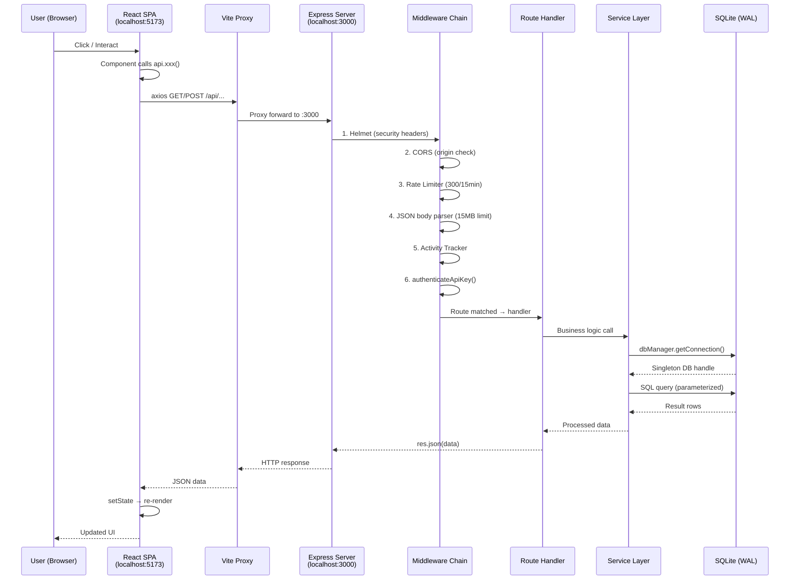
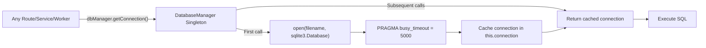
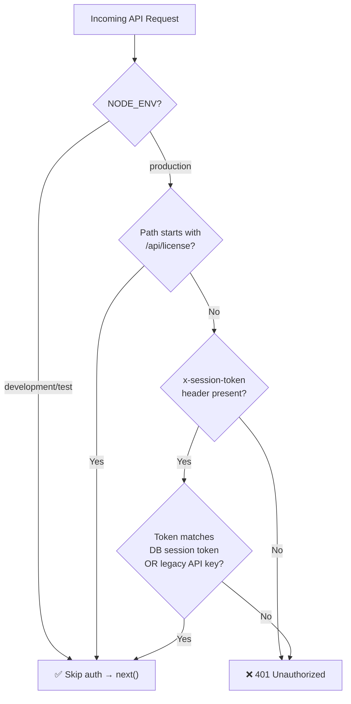
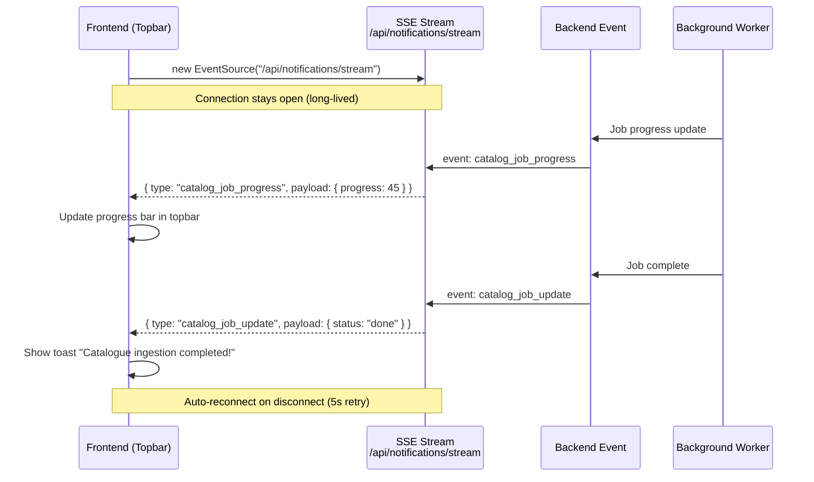
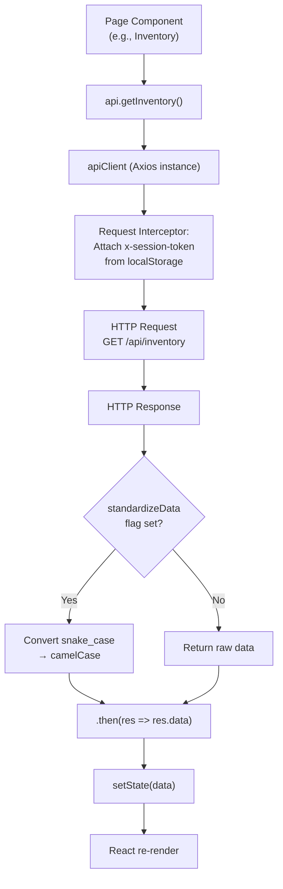
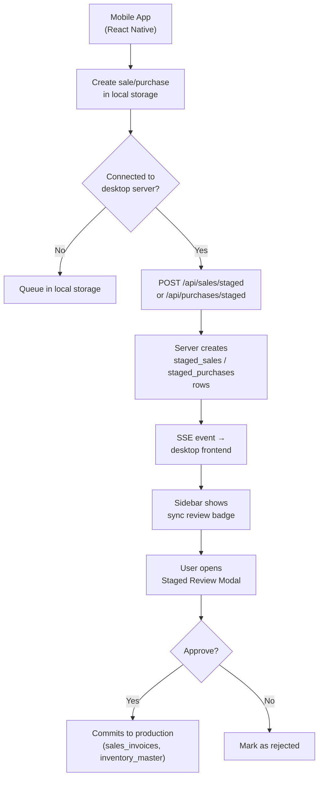
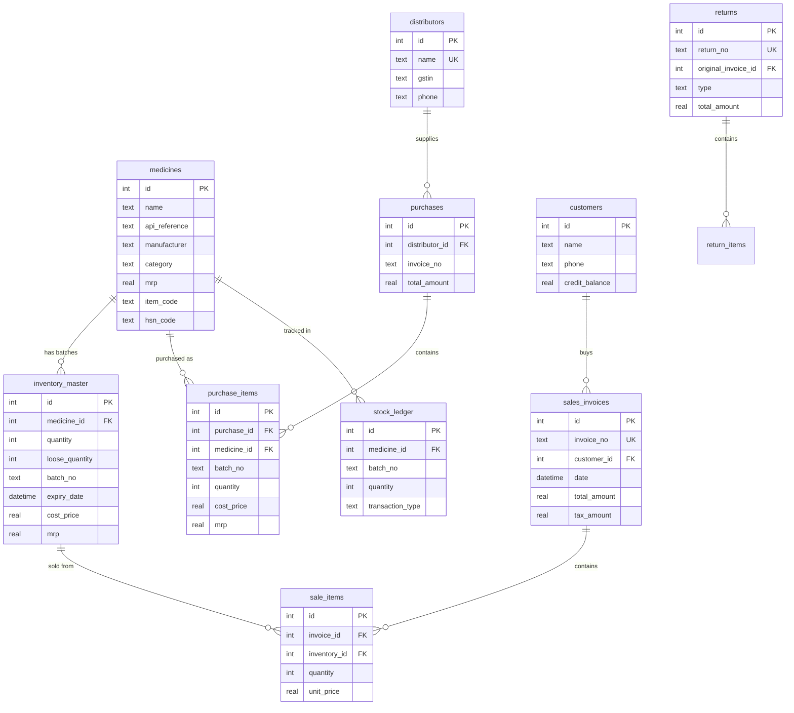

# 🔄 Complete Data Flow — Start to Bottom

This document shows exactly how data moves through the application, from user click to database and back.

---

## 1. Request Lifecycle (Frontend → Database → Frontend)

### Step-by-step in pure text:

1. **User interacts** (clicks button, submits form, navigates page)
2. **React component** calls a method from `frontend/src/services/api.ts` (e.g., `api.getInventory()`)
3. **Axios client** sends HTTP request to `/api/inventory` with session token in `x-session-token` header
4. **Vite dev proxy** forwards the request from `localhost:5173` to `localhost:3000`
5. **Express server** receives the request and runs the middleware chain:
   - **Helmet**: Adds security headers (X-Frame-Options, etc.)
   - **CORS**: Checks `Origin` header against whitelist
   - **Rate Limiter**: Checks if IP has exceeded 300 requests in 15 minutes
   - **Body Parser**: Parses JSON body (max 15MB)
   - **Activity Tracker**: Records timestamp of last user activity
   - **Auth**: Validates session token against database (skipped in dev mode)
6. **Route handler** (`src/routes/inventory.ts`) receives the request
7. **Handler** calls `dbManager.getConnection()` to get the singleton database handle
8. **SQLite query** executes with parameterized SQL (prevents SQL injection)
9. **Result rows** returned from SQLite
10. **Route handler** formats data and sends `res.json(data)`
11. **Response flows back** through Express → Vite proxy → React
12. **React component** updates state → re-renders the UI

---

## 2. Database Connection Flow (Singleton Pattern)

### How it works:

- `DatabaseManager` is a **singleton class** — only one instance exists across the entire application
- On the **first call** to `getConnection()`:
  1. Opens the SQLite database file (`data/app.db`)
  2. Sets `busy_timeout = 5000` (wait up to 5 seconds if database is locked)
  3. Caches the connection handle in `this.connection`
- On **all subsequent calls**: Returns the cached connection immediately (no overhead)
- The entire application (all 33 routes, all 26 services) shares **ONE database connection**

---

## 3. Authentication Flow

### Token sources (checked in order):
1. `x-session-token` header
2. `x-api-key` header (legacy)
3. `api-key` query parameter
4. `apiKey` query parameter

### Token validation:
- Reads `license_session_token` from `app_settings` table
- Falls back to legacy API key from environment config
- WhatsApp Business webhook (`/api/wa-business/webhook`) is always public (Meta sends requests without our token)

---

## 4. Real-Time Notification Flow (SSE)

### SSE event types:
| Event Type | Payload | Frontend Action |
|-----------|---------|-----------------|
| `catalog_job_progress` | `{ id, progress, total_count, processed_count }` | Update topbar progress bar |
| `catalog_job_update` | `{ id, status, error }` | Toast notification |
| `sales_sync` | `{ count }` | Badge on sidebar + toast |
| `purchases_sync` | `{ count }` | Badge on sidebar + toast |
| `auth_failure` | `{ message }` | Error toast → redirect to settings |
| `notification` | `{ message }` | Toast notification |

---

## 5. Frontend API Client Flow

### Key details:
- **Base URL**: `/api` (Vite proxy handles the forwarding)
- **Token attachment**: Reads `session_token` or `api_key` from `localStorage`, attaches as `x-session-token` header
- **Error handling**: 401 responses log a warning (token missing/invalid)
- **Data standardization**: Opt-in `snake_case` → `camelCase` conversion (most endpoints still use raw snake_case for backwards compatibility with 432+ UI elements)

---

## 6. Mobile App Sync Flow

---

## 7. Database Schema — Entity Relationships

### Table count by domain:
| Domain | Tables |
|--------|--------|
| **Core Business** | `medicines`, `inventory_master`, `sales_invoices`, `sale_items`, `purchases`, `purchase_items`, `returns`, `return_items`, `stock_ledger` |
| **CRM** | `customers`, `doctors`, `patient_refills` |
| **Catalog** | `catalog_jobs`, `processed_files`, `medicine_reference`, `medicine_aliases`, `catalog_mappings` |
| **Communication** | `pending_whatsapp_jobs`, `message_templates`, `push_tokens`, `emails`, `email_attachments`, `processed_emails` |
| **Operations** | `dispatch_orders`, `delivery_boys`, `expiry_returns_tracking`, `compliance_logs` |
| **System** | `app_settings`, `action_logs`, `settings`, `held_bills`, `staged_sales`, `staged_purchases` |
| **AI/OCR** | `ocr_corrections`, `ocr_audit_queue`, `distributor_learning_profiles`, `distributor_historical_files` |
