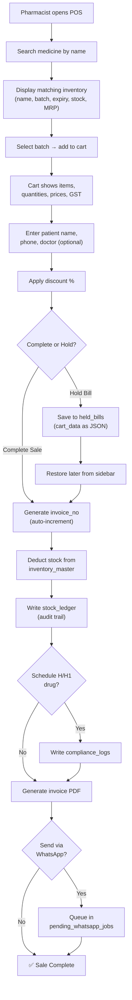
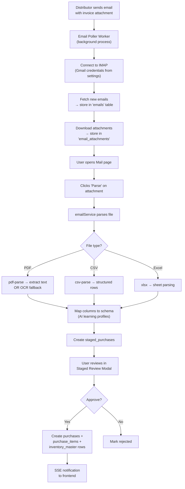
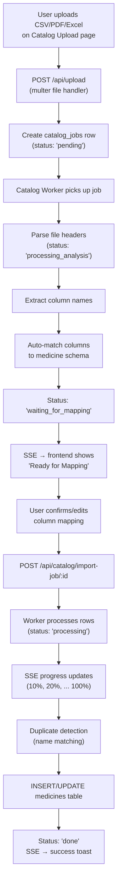
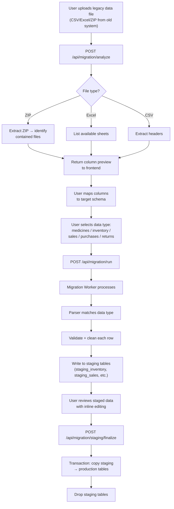
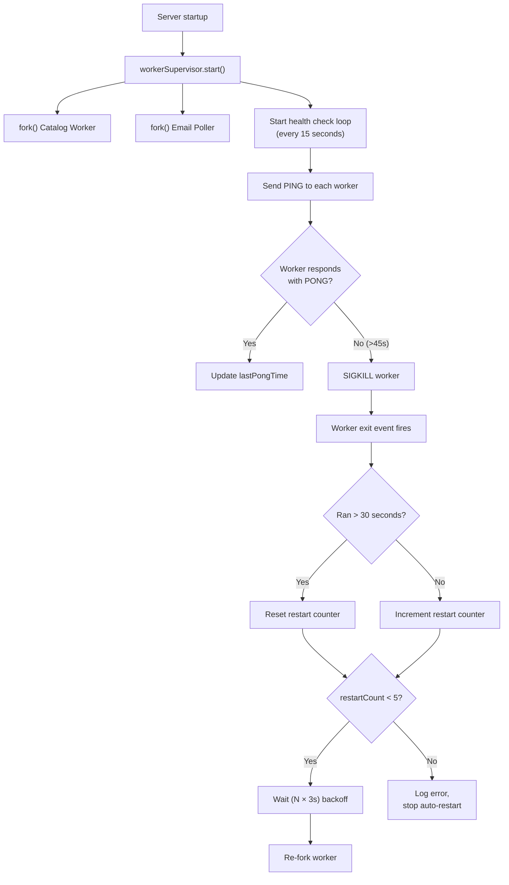
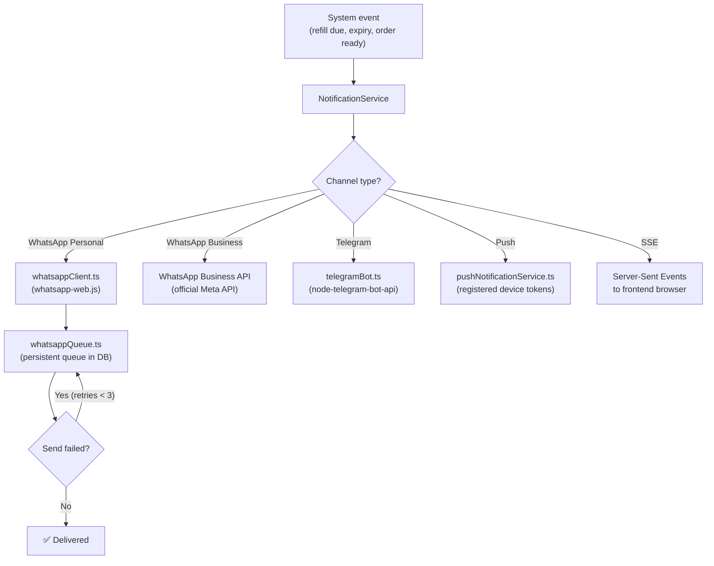
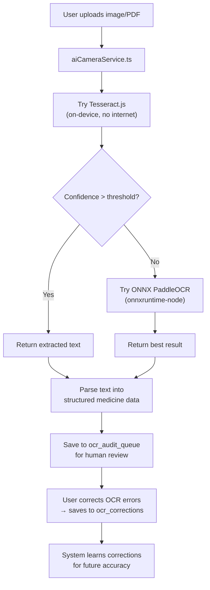
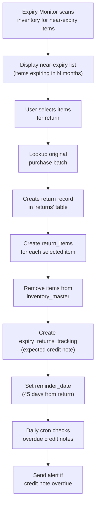

# 📋 All Workflows — Step by Step

Every major workflow in the application, diagrammed and explained in pure context.

---

## 1. Sales / POS Workflow

### Step-by-step:

1. **User opens `/pos`** → POS page loads, shows empty cart
2. **Types medicine name** → `api.searchMedicine(q)` → `GET /api/sales/search-medicine?q=...`
3. **Backend** queries `medicines` JOIN `inventory_master` for matching stock with batch/expiry info
4. **User selects a batch** → item added to local cart state (React state management)
5. **User enters patient info** → name, phone, doctor name (optional)
6. **User can "Hold Bill"** → saves cart to `held_bills` table with JSON serialized cart data, can restore later
7. **User clicks "Generate Bill"** → `api.createSale(data)` → `POST /api/sales`
8. **Backend performs these operations in sequence:**
   - Creates `sales_invoices` row with auto-generated `invoice_no`
   - Creates `sale_items` rows for each cart item
   - Updates `inventory_master.quantity` (decrements for each item)
   - Inserts `stock_ledger` audit entry per item
   - If a Schedule H/H1 drug was sold: inserts `compliance_logs` record
   - Returns `{ invoiceId, invoiceNo }`
9. **Frontend** receives success → shows toast → PDF can be printed
10. **If WhatsApp enabled** → invoice PDF queued in `pending_whatsapp_jobs` for async delivery

---

## 2. Purchase Import Workflow (Email → Inventory)

### Step-by-step:

1. **Distributor emails invoice** (PDF/CSV/Excel attachment) to the pharmacy's Gmail
2. **Email Poller Worker** (background process) connects to IMAP and syncs new emails
3. **Emails stored** in `emails` table with metadata; attachments saved to `email_attachments`
4. **User opens Mail page** → sees inbox with distributor emails
5. **Clicks "Parse"** on an attachment → `emailService` processes the file
6. **File parsing** depends on type: PDF → text extraction (or OCR), CSV → column parsing, Excel → sheet parsing
7. **Column mapping** uses AI learning profiles from `distributor_learning_profiles` to auto-match columns
8. **Staged data** written to `staged_purchases` for human review
9. **User approves** → creates proper `purchases`, `purchase_items`, and `inventory_master` rows
10. **SSE notification** sent to update the frontend

---

## 3. Catalog Import Workflow

### Step-by-step:

1. **User uploads a file** (CSV/PDF/Excel) on the Catalog Upload page
2. **Multer handler** saves file to `uploads/temp/`, creates `catalog_jobs` row
3. **Catalog Worker** (background process) picks up the pending job
4. **Worker analyzes file** — extracts column headers, detects file format
5. **Auto-matching** tries to map columns to medicine schema fields (name, composition, manufacturer, etc.)
6. **Status set to `waiting_for_mapping`** → SSE notification sent to frontend
7. **Frontend shows mapping UI** — user can confirm or edit the auto-detected mappings
8. **User submits mapping** → `POST /api/catalog/import-job/:id`
9. **Worker processes each row** — progress updates sent via SSE (visible in topbar progress bar)
10. **Duplicate detection** — checks if medicine name already exists in `medicines` table
11. **New medicines inserted**, existing ones updated → final status: `done`
12. **Frontend shows success toast** with counts (new, existing, duplicates)

---

## 4. Data Migration Workflow (Legacy System → AI Pharmacy)

### Supported legacy parsers:
- `inventoryParser.ts` — Master data + stock from old systems
- `salesParser.ts` — Sales invoices + line items  
- `returnsParser.ts` — Return bills + line items
- `pgCopyParser.ts` — PostgreSQL COPY format (for direct database exports)
- `pgMasterImporter.ts` — PostgreSQL master data importer
- `pgSalesImporter.ts` — PostgreSQL sales data importer
- `pgPurchaseImporter.ts` — PostgreSQL purchase data importer
- `pgReturnsImporter.ts` — PostgreSQL returns data importer

---

## 5. Background Worker Supervisor Workflow

### How it works:
1. **Server starts** → `workerSupervisor.start()` is called
2. **Two workers are forked** as separate Node.js processes (Catalog Worker, Email Poller)
3. **Health check loop** runs every 15 seconds:
   - Sends `PING` message via IPC to each worker
   - Worker responds with `PONG`
   - If no `PONG` received for 45 seconds → worker is force-killed with `SIGKILL`
4. **On worker exit:**
   - If worker ran for >30 seconds → considered stable, restart counter resets to 0
   - If worker crashed quickly → restart counter increments
   - Backoff delay: 3s, 6s, 9s, 12s, 15s between restarts
   - After 5 consecutive quick failures → stops auto-restart

---

## 6. Notification Multi-Channel Workflow

### Supported notification types:
| Type | Channel | Use Case |
|------|---------|----------|
| WhatsApp Personal | `whatsapp-web.js` | Invoice delivery, refill reminders |
| WhatsApp Business | Meta Cloud API | Templated messages, delivery updates |
| Telegram | Bot API | Low stock alerts, refill alerts, prescription OCR |
| Push Notification | Device token registry | Mobile app notifications |
| SSE | Browser EventSource | Real-time UI updates (progress, sync alerts) |

---

## 7. AI Camera / OCR Workflow

### OCR pipeline details:
1. **Tesseract.js** — Primary OCR engine, runs entirely on-device (no internet needed)
2. **ONNX PaddleOCR** — Secondary engine using `onnxruntime-node`, used when Tesseract confidence is low
3. **Human review** — OCR results are queued in `ocr_audit_queue` for pharmacist verification
4. **Learning** — Corrections stored in `ocr_corrections` table, used to improve future OCR accuracy

---

## 8. Supplier Returns Workflow

---

## 9. Automated Cron Jobs

| Schedule | Cron Expression | Task | Description |
|----------|----------------|------|-------------|
| Daily 9:00 AM | `0 9 * * *` | Patient refills + credit notes | Checks all patient refill schedules, sends reminders. Checks overdue credit notes from suppliers. |
| 1st & 16th of month, 9:00 AM | `0 9 1,16 * *` | Expiry scan | Scans inventory for items expiring within 90 days. Sends WhatsApp/Telegram alerts. |
| Nightly 9:30 PM | `30 21 * * *` | Auto backup | Creates database backup at pharmacy closing time. |
| Every 3h or 6h | `0 */3 * * *` or `0 */6 * * *` | Scheduled backup | User-configured periodic backup frequency. |

### Startup catch-up logic:
When the server starts, it checks:
- Was today's daily check already run? If not → runs immediately
- Is WhatsApp enabled? If yes → pre-initializes the client
- Starts the WhatsApp queue worker
- Starts the backup scheduler
- Starts the worker supervisor
