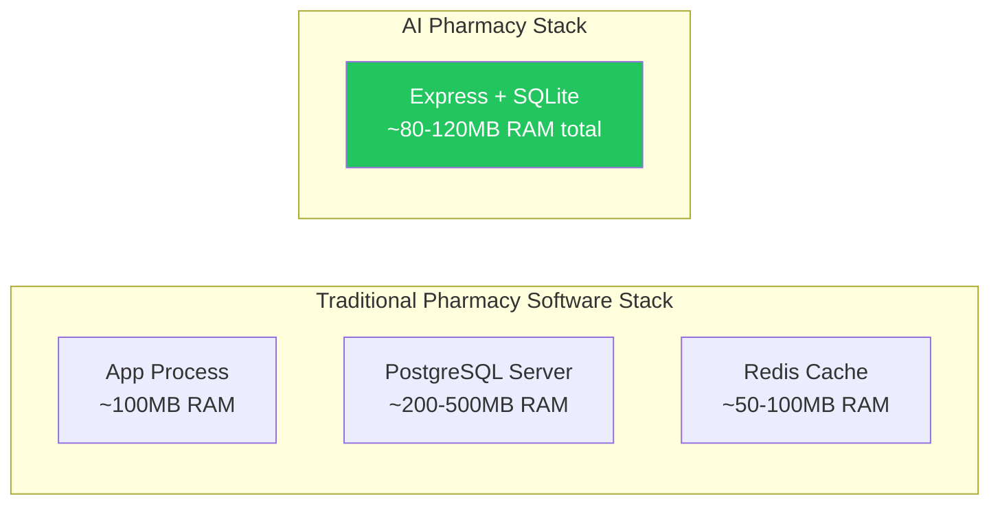
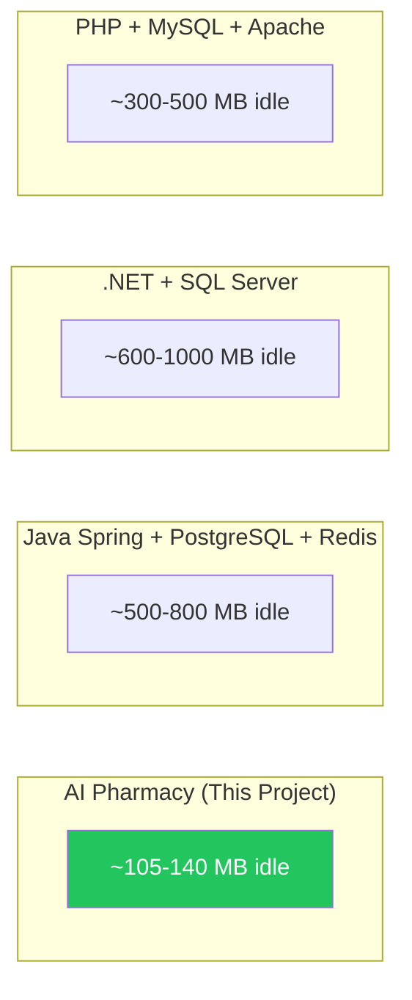

# ⚡ Lightweight & RAM Efficiency Analysis

How and why this application is lightweight, with concrete RAM numbers.

---

## Why This Application is Lightweight

### 1. SQLite — Zero-Process Database



| Aspect | AI Pharmacy | Traditional Setup |
|--------|-------------|-------------------|
| **Database** | SQLite (embedded, 0 extra processes) | PostgreSQL (~200MB+ RAM) |
| **Cache** | SQLite table (`medicine_enrichment_cache`) | Redis (~50MB+ RAM) |
| **Queue** | SQLite table (`pending_whatsapp_jobs`) | RabbitMQ/Redis (~100MB+ RAM) |
| **Total Processes** | 1 main + 2 workers = **3 processes** | 1 app + DB + cache + queue = **4+ processes** |

**Key insight**: SQLite runs **inside** the application process. There is no separate database server consuming RAM. The entire database is a single `data/app.db` file.

---

### 2. Single Connection Singleton

The `DatabaseManager` uses **exactly 1 connection** for the entire application:

```typescript
class DatabaseManager {
  private connection: Database | null = null;
  
  public async getConnection(): Promise<Database> {
    if (!this.connection) {
      this.connection = await open({ filename: dbPath, driver: sqlite3.Database });
      await this.connection.run('PRAGMA busy_timeout = 5000;');
    }
    return this.connection;
  }
}
```

**What this saves:**
- No connection pool overhead (typical pools maintain 5-20 connections × ~2MB each = 10-40MB)
- No connection negotiation per request
- `PRAGMA busy_timeout = 5000` handles concurrent access gracefully — if one write is in progress, other writes wait up to 5 seconds instead of failing

---

### 3. WAL (Write-Ahead Logging) Mode

```sql
PRAGMA journal_mode = WAL;
```

**What WAL does for performance:**
- **Read concurrency**: Multiple readers don't block each other
- **Write performance**: Writes go to a separate WAL file first, then get checkpointed to the main DB
- **No read/write blocking**: Reads can proceed while a write is happening
- **Crash safety**: WAL provides atomic commits without full table locks
- **RAM savings**: No need for in-memory write buffers like MySQL's InnoDB buffer pool

---

### 4. Lazy Loading of Heavy Modules

Heavy dependencies are imported **only when needed**, not at application startup:

```typescript
// pdfjs-dist (~10MB) only loaded when processing scanned PDFs
const pdfjsLib = await import('pdfjs-dist/legacy/build/pdf.mjs');

// ONNX Runtime (~50MB) only loaded when OCR is triggered
const ort = await import('onnxruntime-node');

// WhatsApp client (~20MB) only initialized when enabled in settings
if (waRow?.value === 'true') {
  const { initClient } = await import('./whatsappClient.js');
}

// Canvas (~15MB) only loaded during PDF-to-image rendering
const { createCanvas } = await import('canvas');
```

**What this saves:**
- Startup time reduced by ~3-5 seconds
- Idle RAM reduced by ~50-80MB (heavy modules not loaded until needed)
- If a feature is disabled (e.g., WhatsApp), its dependencies never enter memory

---

### 5. In-Process Workers (fork, not cluster)

Workers are spawned with `child_process.fork()`:

```typescript
const child = fork(config.scriptPath, [], {
  execArgv: [...process.execArgv],
  env: { ...process.env, IS_WORKER: 'true' },
});
```

**Why fork() is lightweight:**
- Workers share the same Node.js binary (~30MB overhead per worker)
- IPC channel (Inter-Process Communication) for heartbeat — no HTTP overhead
- Workers only load the modules they need (catalog worker doesn't load WhatsApp client)
- If a worker crashes, the main server stays up

---

### 6. SSE Instead of WebSockets

Server-Sent Events (SSE) for real-time notifications:

```typescript
// Frontend
const eventSource = new EventSource("/api/notifications/stream");
eventSource.onmessage = (event) => { /* handle */ };
```

**What SSE saves vs WebSockets:**
- **No extra library** needed (native `EventSource` in browsers, plain HTTP in Express)
- **No socket upgrade handshake** — SSE uses standard HTTP
- **No bidirectional connection state** — server just pushes, client just listens
- **No heartbeat overhead** — HTTP keep-alive handles connection persistence
- **Automatic reconnection** built into the browser's EventSource API

---

### 7. In-Memory Cache via SQLite

Instead of running a separate Redis instance, enrichment data is cached in a SQLite table:

```sql
CREATE TABLE medicine_enrichment_cache (
  medicine_name TEXT PRIMARY KEY,
  enriched_data TEXT NOT NULL,
  created_at DATETIME DEFAULT CURRENT_TIMESTAMP
)
```

**What this saves:**
- No separate Redis process (~50-100MB RAM)
- Cache survives server restarts (persistent by design)
- 48-hour TTL expiration via SQL: `DELETE FROM ... WHERE created_at < datetime('now', '-48 hours')`

---

## RAM Footprint Breakdown

| Component | RAM Usage | Notes |
|-----------|-----------|-------|
| Express.js server (main process) | ~50-60 MB | Includes all route/service modules |
| SQLite database engine (in-process) | ~5-10 MB | Depends on active result set sizes |
| Catalog Worker (forked process) | ~30-40 MB | Active during catalog imports |
| Email Poller (forked process) | ~20-30 MB | Lightweight, mostly idle |
| **Total Idle** | **~105-140 MB** | |
| | | |
| **When OCR is active:** | | |
| + Tesseract.js engine | ~50-80 MB | Loaded on-demand, freed after use |
| + ONNX Runtime (PaddleOCR) | ~40-60 MB | Only if Tesseract confidence is low |
| + Canvas (PDF rendering) | ~15-25 MB | Only for scanned PDF pages |
| **Total Active (OCR running)** | **~155-220 MB** | Temporary spike |
| | | |
| **When WhatsApp is active:** | | |
| + Puppeteer/Chromium instance | ~80-150 MB | Only when WhatsApp is enabled |
| **Total with WhatsApp** | **~185-290 MB** | Puppeteer is the heaviest component |

---

## Comparison with Traditional Pharmacy Systems



| System | Typical Idle RAM | Processes | Database Type |
|--------|-----------------|-----------|--------------|
| **AI Pharmacy** | **105-140 MB** | **3** | SQLite (embedded) |
| Java Spring + PostgreSQL + Redis | 500-800 MB | 4+ | PostgreSQL (server) |
| .NET + SQL Server | 600-1000 MB | 3+ | SQL Server (server) |
| PHP + MySQL + Apache | 300-500 MB | 4+ | MySQL (server) |
| Python Django + PostgreSQL | 300-600 MB | 3+ | PostgreSQL (server) |

---

## Why It's Fast Despite SQLite

Common concern: "SQLite is slow for web applications."

**Reality for this use case:**
1. **Single-user system**: This is a pharmacy management tool, not a multi-tenant SaaS. Only 1-3 concurrent users (pharmacist + mobile app).
2. **Read-heavy workload**: Most operations are reads (search medicine, list inventory). SQLite excels at reads.
3. **WAL mode**: Concurrent reads don't block each other.
4. **Indexed queries**: Key columns have indexes (`medicines.name`, `inventory_master.medicine_id`, `inventory_master.batch_no`).
5. **No network latency**: Database is in-process — queries complete in microseconds, not milliseconds.
6. **Small dataset**: Even a large pharmacy has ~10,000-50,000 medicines and ~100,000 transactions. SQLite handles millions of rows efficiently.

---

## Optimization Techniques Already Used

| Technique | Implementation | Impact |
|-----------|---------------|--------|
| **Singleton connection** | `DatabaseManager` class | Eliminates connection churn |
| **WAL journal mode** | `PRAGMA journal_mode = WAL` | Concurrent read performance |
| **Busy timeout** | `PRAGMA busy_timeout = 5000` | Prevents write contention errors |
| **Lazy imports** | Dynamic `import()` for heavy deps | Reduces startup RAM by ~50MB |
| **SQLite-backed cache** | `medicine_enrichment_cache` table | No Redis needed |
| **SQLite-backed queue** | `pending_whatsapp_jobs` table | No RabbitMQ needed |
| **Process isolation** | `child_process.fork()` for workers | Worker crashes don't kill server |
| **SSE over WebSockets** | Native EventSource | No library overhead |
| **Activity tracker** | Filters out background polling | Accurate idle detection |
| **Backup retention** | Max 20 backups, auto-cleanup | Prevents disk bloat |
