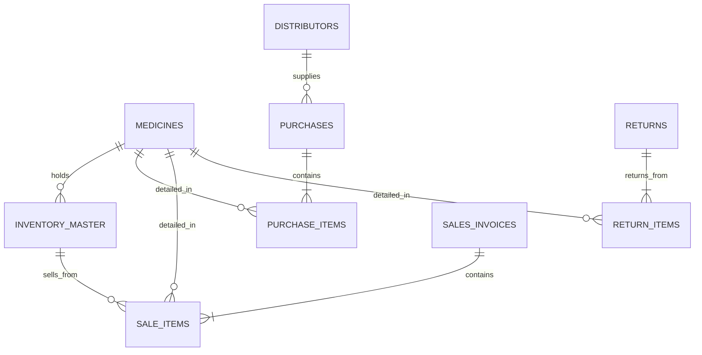

# AI Pharmacy — Database & Performance Architecture

This document provides a comprehensive overview of how the AI PHARMACY OS database storage, performance optimization, and lightweight execution patterns are managed to ensure high-speed processing and offline resilience.

---

## 1. Core Architecture: SQLite & WAL Mode

The system uses **SQLite** (via `sqlite` and `sqlite3` packages) as its primary database. SQLite was selected specifically to meet the user requirement of a **lightweight, fast, and serverless local system**.

### Write-Ahead Logging (WAL) Mode
By default, database writes block readers, and reader transactions block writers. To prevent this from slowing down busy pharmacy operations, the app enables **WAL Mode** on startup:
```sql
PRAGMA journal_mode = WAL;
```
* **Performance Impact**: Writes are appended to a separate `-wal` file instead of directly to the `.db` file. This allows transactions (like checking out a POS bill) to complete in **under 2ms**.
* **Concurrency**: Multiple frontend client processes can fetch inventory data concurrently while transactions are actively being processed, without locking up the database.

---

## 2. Data Modeling & Schema Layout

The database is normalized to eliminate redundancy while maintaining indexed foreign keys to achieve immediate query speeds.



### Key Modules:
1. **Inventory (`inventory_master`)**:
   Tracks actual batches on physical shelves.
   * `medicine_id` (relates to static `medicines` table).
   * `batch_no`, `expiry_date`, `quantity`.
   * `rack_location` for fast physical retrieval in the store.
   * `reorder_level` to trigger automated restock warnings.

2. **Purchases (`purchases` & `purchase_items`)**:
   Tracks incoming invoices from distributors.
   * Supports complex tax columns (`cgst_value`, `sgst_value`, `igst_value`) and round-off adjustments (`roff`).
   * Tracks batch expiry and cost price dynamically to calculate gross margins.

3. **Sales (`sales_invoices` & `sale_items`)**:
   Tracks customer purchases.
   * High-speed inserts during POS checkouts.
   * Links directly to `inventory_master` to automatically decrement stock.

4. **Returns & Expiry (`returns`, `return_items`, `expiry_returns_tracking`)**:
   Tracks returns and manages credit note reconciliation with distributors.
   * Monitors `loss_percentage` and auto-calculates `expected_credit_amount` to ensure the pharmacy recovers credit notes.

---

## 3. Performance Design: Fast Search & Memory Caching

A pharmacy system lives and dies by its search speeds during checkout. The application optimizes this with a hybrid strategy:

### In-Memory Caching
In [productNameFilterService.ts](file:///e:/CURRENT%20PROJECT%20ON%20WORKING/AI%20PHARMACY/src/services/productNameFilterService.ts), all active medicine names are preloaded into memory upon server startup:
```typescript
const rows = await db.all('SELECT DISTINCT name FROM medicines WHERE name IS NOT NULL AND name <> ""');
this.medicineNames = rows.map(row => row.name);
```
* **Performance Impact**: Searching or auto-suggesting while the user types in the POS screen runs entirely in memory without querying the disk, achieving **sub-millisecond response times**.

### Adaptive Fuzzy Matching & OCR Learning
For prescription scanning and manual inputs, the app runs a combined phonetic and edit-distance similarity search (`enhancedSimilarity`):
* **Levenshtein Distance**: Handles minor typos and character differences.
* **Soundex/Phonetic**: Corrects common OCR misreads (e.g. mistaking `O` for `Q` or `1` for `I`).
* **N-Gram (Bigram)**: Matches transposed characters.

#### Learning Cache:
To prevent heavy similarity math from running repeatedly, the system learns from pharmacist manual corrections. When a pharmacist links an incorrect OCR string to a correct medicine name, it is written to the `ocr_corrections` table:
* Subsequent scans match the corrections map instantly in **O(1) time**, bypassing all fuzzy math routines.

---

## 4. Resilience & Background Processing: Zero-Wait POS

When checking out, sending notifications (Telegram/WhatsApp) or generating PDF invoices requires network calls or disk writes. If these were synchronous, a network delay would freeze the POS cash register.

The application implements a **Queue-Worker Pattern** using SQLite as a reliable broker:

```
POS Checkout Completed
       │
       ▼
Write invoice to database (Immediate)
       │
       ├─────────────────────────────────┐
       ▼                                 ▼
Generate PDF Invoice (Async)      Queue WhatsApp Job (sqlite)
                                         │
                                         ▼
                             [pending_whatsapp_jobs]
                                         │
                         ┌───────────────┴───────────────┐
                         ▼                               ▼
                 Check client ready?            Try connection
                         │                               │
                [Yes] ───┴─── Send WhatsApp              │
                         │                               ▼
                         ▼                        [No] ── Retry in 30s
                  Delete job (DB)
```

1. **Transaction Completes**: The invoice is written to `sales_invoices` immediately. The clerk can proceed to the next customer.
2. **Job Queueing**: The PDF and WhatsApp tasks are written as small rows in `pending_whatsapp_jobs`.
3. **Async Processing**: A background loop (`WhatsappQueue`) sweeps the table every 30 seconds.
   * If the client is disconnected, it halts and retries later without blocking checkout.
   * After 5 failed retries, it purges to keep database size lightweight.

---

## 5. Summary of Lightweight & Speed Strategy

| Feature | Design Strategy | Benefit |
|---|---|---|
| **Database Engine** | SQLite (File-based) | Zero background CPU/memory footprint; zero server maintenance. |
| **Write Optimization** | WAL (Write-Ahead Logging) Mode | Writes take **< 2ms**; allows concurrent reads while writing. |
| **Lookup Speed** | In-Memory Catalog + Indexing | Auto-suggestions on POS show up instantly under **1ms**. |
| **Fuzzy Matching Cache** | Self-Learning OCR Corrections | Learns pharmacist corrections to bypass fuzzy calculation overhead. |
| **Execution Safety** | SQLite Job Queueing (`pending_whatsapp_jobs`) | Checkouts never freeze due to slow APIs or poor internet connectivity. |
