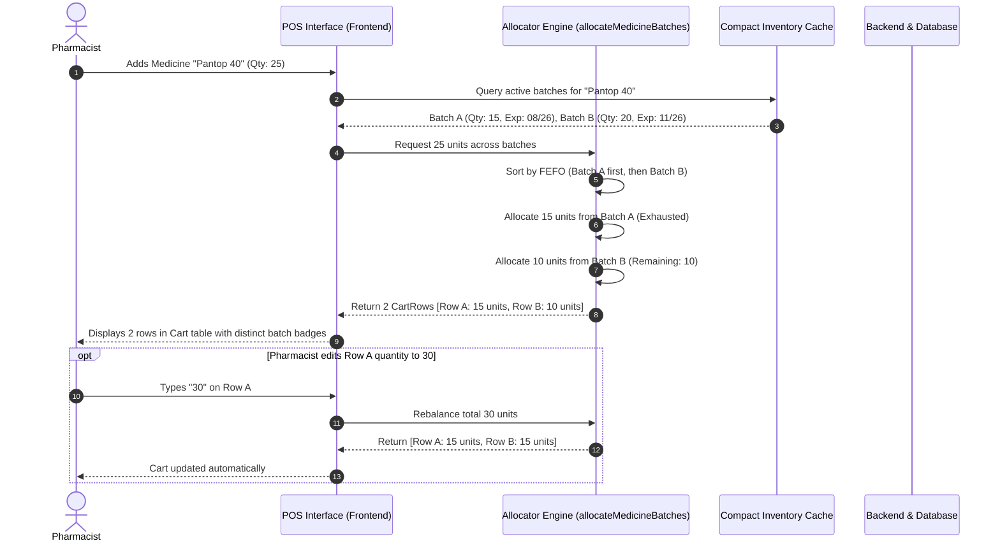
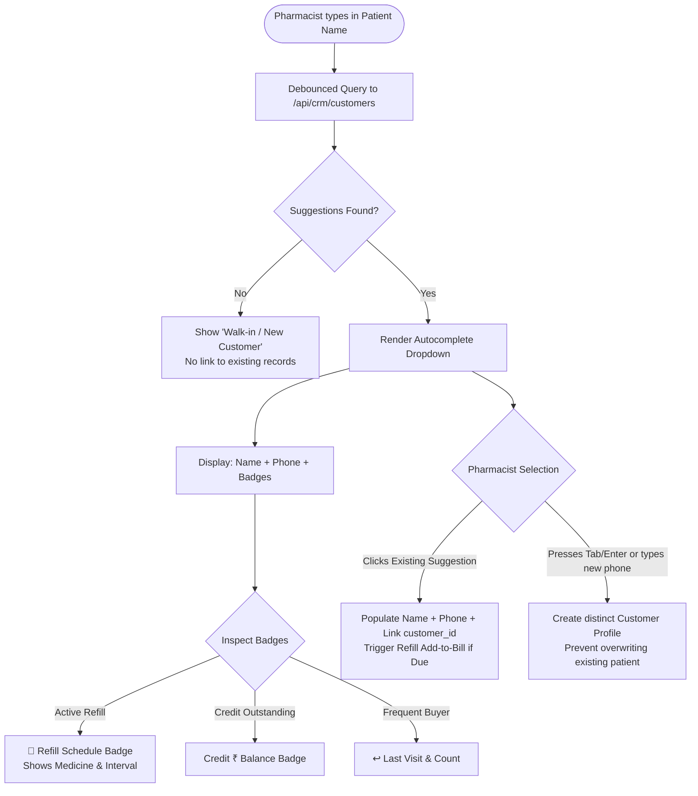

# 📋 Core Pharmacy Workflows & Logic Specification: Multi-Batch Spillover, Purchases & Patient Refill Disambiguation

> **Single Source of Truth** for:
> 1. **Multi-Batch Auto-Allocation & Spillover Engine** (FEFO distribution across POS, Purchases, and Returns).
> 2. **Patient Disambiguation & Refill Resolution Architecture** (distinguishing same-name patients, active refill schedules, and new vs. returning customers).
> 3. **Purchases Ingestion & Multi-Batch Inward Flow** (batch segregation, schemes, rates, and inventory ingestion).

---

## 📑 Table of Contents

1. [Executive Summary & Core Principles](#1-executive-summary--core-principles)
2. [Multi-Batch Auto-Allocation & Spillover Engine](#2-multi-batch-auto-allocation--spillover-engine)
   - [2.1 The Problem & Business Requirement](#21-the-problem--business-requirement)
   - [2.2 Universal FEFO Allocation Algorithm](#22-universal-fefo-allocation-algorithm)
   - [2.3 Dynamic Cart Rebalancing on Quantity Change](#23-dynamic-cart-rebalancing-on-quantity-change)
   - [2.4 Batch Overrides & Alternatives Popover](#24-batch-overrides--alternatives-popover)
   - [2.5 Edge Cases: Stock Depletion, Expired Batches & Loose Quantities](#25-edge-cases-stock-depletion-expired-batches--loose-quantities)
3. [Patient Identification & Refill Disambiguation](#3-patient-identification--refill-disambiguation)
   - [3.1 The Problem: Same-Name Patients & Refill Ambiguity](#31-the-problem-same-name-patients--refill-ambiguity)
   - [3.2 The Disambiguation Visual Hierarchy](#32-the-disambiguation-visual-hierarchy)
   - [3.3 Decision Flow: Existing Refill vs. New Walk-in Patient](#33-decision-flow-existing-refill-vs-new-walk-in-patient)
   - [3.4 End-to-End Refill Lifecycle in POS & CRM](#34-end-to-end-refill-lifecycle-in-pos--crm)
4. [Purchases & Goods Inward Batch Logic](#4-purchases--goods-inward-batch-logic)
   - [4.1 Multi-Batch Invoicing for the Same Medicine](#41-multi-batch-invoicing-for-the-same-medicine)
   - [4.2 Scheme Calculations (Paid + Free) & Effective Rates](#42-scheme-calculations-paid--free--effective-rates)
   - [4.3 Inventory Ingestion & Isolated Batch Records](#43-inventory-ingestion--isolated-batch-records)
5. [Visual Process Diagrams (Mermaid)](#5-visual-process-diagrams-mermaid)
6. [Code Implementation & Architecture Map](#6-code-implementation--architecture-map)

---

## 1. Executive Summary & Core Principles

Modern retail pharmacy operations demand speed, accuracy, and zero regulatory or dispensing errors. Two frequent operational challenges are:

1. **Batch Fragmentation**: When a customer orders 20 strips of *Paracetamol 650mg*, but Batch `B101` only has 12 strips in stock and Batch `B102` has 15 strips. The system must **never** block the sale or force manual math. It must automatically allocate 12 strips from `B101`, create a secondary row with 8 strips from `B102` (FEFO order), and maintain strict traceability for expiry, cost, MRP, and taxes.
2. **Patient Identity Collision**: Multiple patients frequently share names (e.g., *"Rahul Sharma"* or *"Sita Devi"*). Without clear visual differentiators (phone number, active refill badges, last visit dates, outstanding credit), pharmacists risk assigning chronic prescription refills to the wrong person or failing to register a new walk-in customer properly.

### Core Architectural Contracts:
* **Strict FEFO (First Expiry, First Out)**: Unexpired batches expiring earliest are always consumed first. Full strips take priority over loose-only units.
* **Non-Destructive Batch Isolation**: Every batch has a distinct `inventory_id`, `batch_no`, `expiry_date`, `cost_price`, `sell_price`, and `mrp`. Batches are never blended into a single composite quantity in the database.
* **Phone & Customer ID as Disambiguators**: Patient names are for search; `customer_id` and normalized 10-digit phone numbers are for identity resolution.

---

## 2. Multi-Batch Auto-Allocation & Spillover Engine

### 2.1 The Problem & Business Requirement

In high-volume dispensing, forcing a pharmacist to check stock per batch, manually type multiple rows, and calculate remaining units slows down checkouts and causes billing queues.

**Requirement**:
* When adding a medicine to the POS cart or updating its quantity (e.g., from 5 to 25):
  * Check current/FEFO batch stock.
  * If the requested quantity fits in the earliest expiring batch, allocate it to a single row.
  * If the requested quantity exceeds the batch stock, exhaust that batch completely, then **automatically generate an additional row** for the next FEFO batch with the remaining quantity.
  * If requested quantity exceeds total stock across *all* active batches, cap at total available stock and trigger an informative non-blocking notification.

---

### 2.2 Universal FEFO Allocation Algorithm

The core allocation is driven by `allocateMedicineBatches()` in `frontend/src/pages/POS/index.tsx`.

```
┌─────────────────────────────────────────────────────────────┐
│               User Requests: Qty = 25 strips                │
└──────────────────────────────┬──────────────────────────────┘
                               │
                               ▼
┌─────────────────────────────────────────────────────────────┐
│ 1. Filter Compact Inventory:                                │
│    - medicine_id == target                                  │
│    - Stock > 0 (stock_qty > 0 || loose_qty > 0)             │
│    - Expiry > Current Date (strict non-expired check)       │
└──────────────────────────────┬──────────────────────────────┘
                               │
                               ▼
┌─────────────────────────────────────────────────────────────┐
│ 2. Sort Batches by FEFO Rank:                               │
│    - Strips available first (stock_qty > 0 beats loose)     │
│    - Earliest parsed expiry timestamp (expDate ASC)         │
│    - Deterministic tie-breaker: inventory_id ASC            │
└──────────────────────────────┬──────────────────────────────┘
                               │
                               ▼
┌─────────────────────────────────────────────────────────────┐
│ 3. Greedy Allocation Loop:                                  │
│    Batch 1 (Exp: 09/26, Stock: 15)  ──► Takes 15 (Rem: 10)  │
│    Batch 2 (Exp: 12/26, Stock: 20)  ──► Takes 10 (Rem: 0)   │
└──────────────────────────────┬──────────────────────────────┘
                               │
                               ▼
┌─────────────────────────────────────────────────────────────┐
│ 4. Output: Two distinct CartRow objects                     │
│    - Row 1: Batch 1, Qty 15, MRP ₹100, Exp 09/26            │
│    - Row 2: Batch 2, Qty 10, MRP ₹105, Exp 12/26            │
└─────────────────────────────────────────────────────────────┘
```

#### Code Logic Specification (`allocateMedicineBatches`):
```typescript
interface AllocateParams {
  medicineId: number;
  medicineName: string;
  requestedQty: number;
  requestedLooseQty: number;
  packSize?: number;
  fallbackItem?: Partial<CartRow>;
  compactInventory: CompactInventoryItem[];
  editingInvoiceId?: number | null;
}

export function allocateMedicineBatches(params: AllocateParams): CartRow[] {
  const { medicineId, medicineName, compactInventory, requestedQty, requestedLooseQty } = params;
  const pSize = Math.max(1, params.packSize || 1);
  const totalRequestedTablets = (requestedQty * pSize) + (requestedLooseQty || 0);

  // 1. Filter active, unexpired batches with stock
  const activeBatches = (compactInventory || [])
    .filter(item => {
      const match = (item.medicine_id === medicineId || item.id === medicineId);
      const hasStock = ((item.stock_qty ?? item.quantity) || 0) > 0 || (item.loose_quantity || 0) > 0;
      const notExpired = parseExpiry(item.expiry_date) > new Date();
      return match && hasStock && notExpired;
    })
    .sort((a, b) => compareFEFO(a, b));

  // 2. Distribute tablets across batches
  let remainingTablets = totalRequestedTablets;
  const allocations: CartRow[] = [];

  for (const batch of activeBatches) {
    const batchStockTablets = (batch.stock_qty || 0) * pSize + (batch.loose_quantity || 0);
    if (remainingTablets > 0 && batchStockTablets > 0) {
      const takenTablets = Math.min(remainingTablets, batchStockTablets);
      const qty = Math.floor(takenTablets / pSize);
      const looseQty = takenTablets % pSize;

      if (qty > 0 || looseQty > 0) {
        allocations.push(buildCartRowFromBatch(batch, qty, looseQty, pSize));
        remainingTablets -= takenTablets;
      }
    }
  }

  return allocations;
}
```

---

### 2.3 Dynamic Cart Rebalancing on Quantity Change

When a user adjusts `qty` or `looseQty` on *any* row in the POS cart:
1. `updateCartItem(id, 'qty', newVal)` intercepts the edit.
2. It invokes `rebalanceCartMedicine()`:
   * Aggregates the total tablets across **all rows of that same medicine** currently in the cart.
   * Incorporates the newly edited row's target quantity.
   * Runs `allocateMedicineBatches()` for the new grand total.
   * Seamlessly replaces the existing group of rows for that medicine with the newly calculated batch rows.
3. If the user decreases quantity (e.g., from 25 to 10), the secondary spillover row is automatically collapsed and removed from the cart.
4. If the user increases quantity, additional rows are created as required.

---

### 2.4 Batch Overrides & Alternatives Popover

Pharmacists can manually override the automatic FEFO selection:
1. In each cart row, the **Batch Pill** displays the allocated batch number and expiry.
2. Clicking the batch pill opens the **Alternative Batches Popover**.
3. It lists all other in-stock batches with stock count, expiry date, MRP, and purchase rate.
4. Selecting a different batch swaps that specific row's allocation to the chosen batch.

---

### 2.5 Edge Cases: Stock Depletion, Expired Batches & Loose Quantities

| Scenario | Behavior & Logic |
|---|---|
| **Requested > Total Stock** | Allocates 100% of all available unexpired batches. Caps requested amount. Triggers `toastEvent.trigger("Only X units available. Capped to stock.", "info")`. |
| **Expired Batches in Stock** | Strictly filtered out. Expired inventory is never allocated to POS cart. |
| **Partial Strip (Loose) Units** | Calculates `totalTablets = (qty * packSize) + looseQty`. Loose stock in a batch is consumed alongside strip stock. |
| **Editing Previous Invoice** | Historical batch allocation from the saved invoice is respected and not forcefully overridden unless manually edited. |

---

## 3. Patient Identification & Refill Disambiguation

### 3.1 The Problem: Same-Name Patients & Refill Ambiguity

In retail pharmacies, customer names frequently overlap:
* "Ramesh Patel" (Walk-in, buying cough syrup once)
* "Ramesh Patel" (Chronic hypertension refill patient, takes Telmisartan 40mg monthly, Phone: 9876543210)
* "Ramesh Patel" (Elderly diabetic patient, takes Metformin 500mg, Phone: 9123456789)

Accidentally mixing these records causes:
1. Misdirected WhatsApp bills and refill notifications.
2. Refill schedules linked to the wrong customer ID.
3. Unintended credit balance merging.

---

### 3.2 The Disambiguation Visual Hierarchy

When typing in the **Patient Name** input (`#patient-name-input`), an interactive dropdown renders with rich disambiguation metadata:

```
┌─────────────────────────────────────────────────────────────────────────────┐
│ [ Ramesh Patel                          ]  [ Mobile / WhatsApp           ]  │
├─────────────────────────────────────────────────────────────────────────────┤
│ ┌─────────────────────────────────────────────────────────────────────────┐ │
│ │ Ramesh Patel   [🔁 Refill]                 98765-43210                  │ │
│ │ └─ Telmisartan 40mg (Due: Today, Refill every 30 days)                  │ │
│ ├─────────────────────────────────────────────────────────────────────────┤ │
│ │ Ramesh Patel   [Credit ₹450]   [↩ 4 visits] 91234-56789                 │ │
│ │ └─ Last purchase: 14 Aug 2026                                           │ │
│ ├─────────────────────────────────────────────────────────────────────────┤ │
│ │ ➕ Create as New Patient "Ramesh Patel" (Press Enter / Tab)              │ │
│ └─────────────────────────────────────────────────────────────────────────┘ │
└─────────────────────────────────────────────────────────────────────────────┘
```

#### Visual Chips & Badges:
1. **`🔁 Refill` Badge (Violet)**: Highlighted when `c.active_refill === 1`. Indicates an active chronic refill schedule.
2. **`Credit ₹...` Badge (Amber)**: Displayed when `c.credit_balance > 0` or credit is enabled.
3. **`↩ Last Visit` Indicator (Subtle Muted)**: Shows visit frequency (`purchase_count`) and latest transaction date.
4. **Phone Number (Mono Font)**: Displayed on the right edge for instant verification by the pharmacist.

---

### 3.3 Decision Flow: Existing Refill vs. New Walk-in Patient

```
                       User Types Patient Name
                                 │
                                 ▼
                     Are suggestions returned?
                                 │
               ┌─────────────────┴─────────────────┐
               ▼                                   ▼
             YES                                  NO
               │                                   │
               ▼                                   ▼
    Does a suggestion match?                User continues typing
    (Verified by Phone & Refill details)    or presses Tab / Enter
               │                                   │
       ┌───────┴────────┐                          ▼
       ▼                ▼                 New Patient Record
    Select           Click / Ignore       - Treated as Walk-in / New
  Suggestion          Suggestion          - No refill overwrite
       │                │                 - Creates fresh customer entry
       ▼                ▼                   upon sale save (if phone given)
   Populates:       Treated as
   - Patient Name   New Patient
   - Phone Number   with same name
   - Linked Refill
   - Credit Balance
```

---

### 3.4 End-to-End Refill Lifecycle in POS & CRM

1. **Auto-Refill Alert Banner**:
   * If a selected patient has a refill due within $\pm 5$ days, POS displays a floating reminder:
     > `🔁 Refill Due: Ramesh Patel has a refill for Telmisartan 40mg (Due Today).`
   * Buttons: `[+ Add to Bill]` or `[Ignore]`.
2. **Refill Auto-Advance on Sale Completion**:
   * When the sale is saved with `refillEnabled = true` or matching a `refillId`:
   * Backend advances the refill schedule:
     $$\text{next\_refill\_date} = \text{sale\_date} + \text{refill\_interval\_days}$$
   * Logs transaction to `refill_logs` and marks notification pending for the next cycle.

---

## 4. Purchases & Goods Inward Batch Logic

### 4.1 Multi-Batch Invoicing for the Same Medicine

In the **Purchases Page** (`frontend/src/pages/Purchases/index.tsx`), distributor invoices often contain multiple distinct batches of the same product (e.g. 50 boxes of Batch `A1` and 30 boxes of Batch `A2`).

**Behavior**:
* Each batch is entered as an independent **BillItem** row.
* Each row maintains:
  * `batch_no`: Unique distributor batch identifier.
  * `expiry_date`: Standardized `MM/YY` or `YYYY-MM-DD`.
  * `qty`: Paid quantity.
  * `free_qty`: Scheme free quantity.
  * `rate`: Purchase rate per unit/pack.
  * `mrp`: Maximum Retail Price for this specific batch.
  * `cd_per` / `cd_rs`: Cash discount.
  * `cgst_per` / `sgst_per`: Tax percentages.

---

### 4.2 Scheme Calculations (Paid + Free) & Effective Rates

When receiving scheme goods (e.g., $10 + 1$ Free):
1. **Total Physical Inward**: $\text{Total Stock Inward} = \text{qty} + \text{free\_qty}$.
2. **Total Bill Amount**: $\text{Amount} = (\text{qty} \times \text{rate}) - \text{Discount} + \text{Taxes}$.
3. **Effective Net Cost Per Unit**:
   $$\text{Effective Cost} = \frac{\text{Net Invoiced Amount}}{(\text{qty} + \text{free\_qty}) \times \text{pack\_size}}$$

---

### 4.3 Inventory Ingestion & Isolated Batch Records

Upon clicking **Save Purchase Bill**:
1. Backend creates/updates records in the `inventory` table keyed by `(medicine_id, batch_no)` via `idx_inventory_batch_medicine`.
2. Stock is incremented strictly on that specific batch record.
3. Expiry date and batch-specific MRP/Sell Price are stored atomically.
4. Subsequent POS searches immediately see the new batch in the `compactInventory` cache via SSE / cache invalidation.

---

## 5. Visual Process Diagrams (Mermaid)

### 5.1 POS Batch Allocation & Spillover Flow



### 5.2 Patient Search & Disambiguation Flow



---

## 6. Code Implementation & Architecture Map

| Subsystem | Key Files | Core Functions / Endpoints | Responsibility |
|---|---|---|---|
| **POS Allocation** | `frontend/src/pages/POS/index.tsx` | `allocateMedicineBatches()`, `rebalanceCartMedicine()` | FEFO batch distribution, multi-row split, and quantity rebalancing |
| **POS Patient UI** | `frontend/src/pages/POS/index.tsx` | `#patient-name-input`, `#patient-phone-input` | Interactive suggestions, refill chip display, customer ID linking |
| **Backend Sales API** | `src/routes/sales.ts` | `POST /api/sales`, `POST /api/sales/hold` | Stock deduction per batch, customer creation/resolution, refill schedule auto-advancement |
| **Purchases Inward** | `frontend/src/pages/Purchases/index.tsx` | `BillItem`, `calculateItemValues()`, `handleSave()` | Multi-batch purchase entry, scheme calculations, distributor price matching |
| **Backend Purchases API** | `src/routes/purchases.ts` | `POST /api/purchases` | Atomic inventory batch creation (`idx_inventory_batch_medicine`), purchase ledger logging |
| **Refills & CRM** | `src/routes/crm.ts`, `frontend/src/pages/Refill/index.tsx` | `GET /api/crm/customers`, `GET /api/crm/refills` | Chronic patient tracking, WhatsApp refill notifications, contact resolution |

---

*This document is a binding architectural specification for AI Pharmacy v2.*
