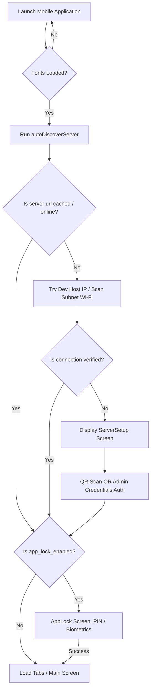
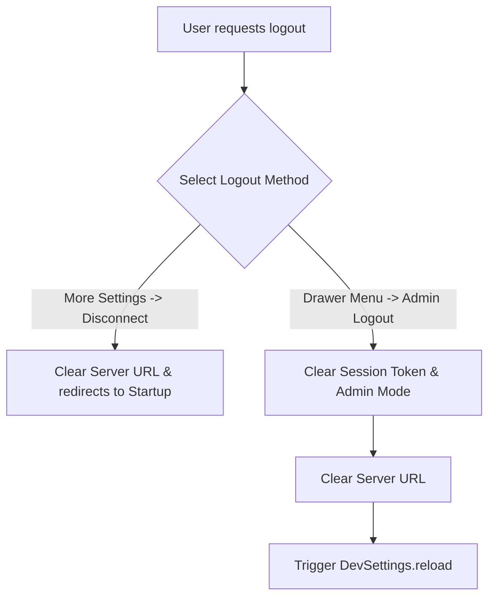
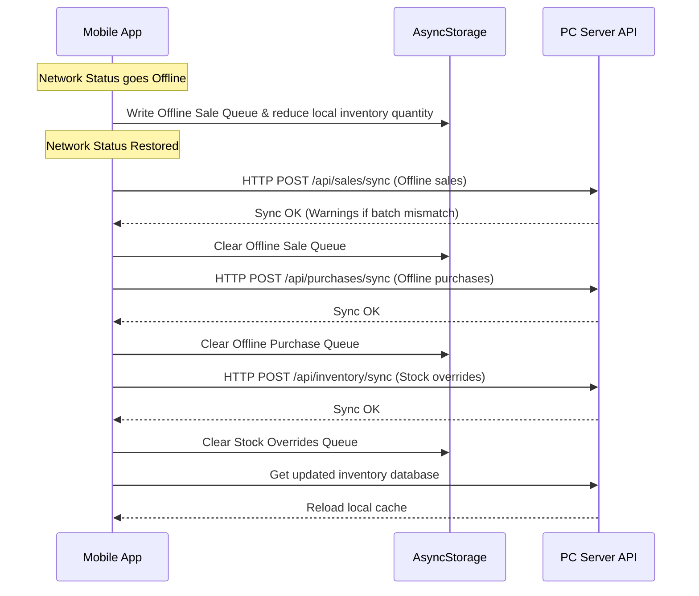

# AI Pharmacy OS — Mobile Application Architecture & Workflow Context

This document provides a comprehensive, developer-level reference for the **AI Pharmacy OS** React Native (Expo) mobile application (`pharmacy-mobile/`). It outlines the codebase structure, state management, security configurations, network communication, offline queue mechanics, and the step-by-step user journey from connection/login to teardown/logout.

---

## 1. System Overview & Technology Stack

The mobile application is a high-performance, dark-themed React Native application built on the **Expo framework (v56.0.0)**. It serves as the companion interface to the PC-based Express.js/SQLite backend, allowing staff and distributors to perform inventory management, point-of-sale billing, AI package scanning, and email integrations on the go.

### Key Technologies
*   **Framework & Navigation**: React Native + Expo SDK, structured with **Expo Router** (file-based navigation in `app/`).
*   **Authentication**: Biometric and device-native credentials via `expo-local-authentication` and secure keychain storage via `expo-secure-store`.
*   **Styling**: Premium dark mode theme using a customized visual system defined in `lib/theme.ts` (utilizing deep blues, purples, and mint-green accent highlights).
*   **Network & Messaging**: REST APIs via standard `fetch`, real-time server-sent event (SSE) streaming via raw `XMLHttpRequest`, direct Gmail REST API client integration, and background fallback message dispatchers.
*   **Local Caching**: Double-layered storage using encrypted `SecureStore` (credentials, tokens, IP caches) and high-capacity `AsyncStorage` (medicine catalog, offline queues, notification logs).

---

## 2. Core Navigation Structure (`app/`)

The file-based routing directory determines the app layout:

```
pharmacy-mobile/app/
├── _layout.tsx              # Root Layout, handles global toast, connection watchdog, push token registration, and auth gates
├── +not-found.tsx          # Fallback 404 Route
├── backup/
│   └── index.tsx            # Database Backup utility triggering PC backup endpoints
├── camera/
│   └── index.tsx            # Camera view using Expo Camera for OCR package detection
├── notifications/
│   └── index.tsx            # Push notification alerts history log page
├── product-search/
│   └── index.tsx            # Product Trace screen mapping purchase & sale transaction cycles
└── (tabs)/
    ├── _layout.tsx          # Bottom Tab Navigator setup
    ├── index.tsx            # Assistant Chat screen (primary dashboard)
    ├── billing/
    │   └── index.tsx        # POS Billing counter checkout screen
    ├── inventory/
    │   └── index.tsx        # Stock browser list with batch detail lookups
    ├── purchases/
    │   └── index.tsx        # Distributor purchase invoice tracking log
    └── more/
        └── index.tsx        # Security, Gmail, & server connection settings
```

---

## 3. Detailed Data Storage Schema

Storage keys and caches are distributed based on security sensitivity:

| Storage Key | Engine | Sensitive? | Purpose / Contents |
| :--- | :--- | :--- | :--- |
| `pharmacy_server_url` | `SecureStore` | No | Target base URL of the PC server (e.g. `http://192.168.1.15:3000`) |
| `admin_session_token` | `SecureStore` | Yes | Token retrieved on successful admin key authentication, sent via `x-session-token` header |
| `is_admin_mode` | `SecureStore` | No | Flag (`"true"`/`"false"`) identifying if the mobile app has full admin capabilities |
| `admin_device_uuid` | `SecureStore` | Yes | Automatically generated unique identifier (`DEV-xxxx`) mapping device registration |
| `app_lock_enabled` | `SecureStore` | No | Flag indicating if biometric/PIN security challenge screen is triggered on launch |
| `app_lock_pin` | `SecureStore` | Yes | 4-digit fallback PIN code used to unlock the app UI (defaults to `"1234"`) |
| `gmail_user` | `SecureStore` | No | Associated Gmail email address for direct mail synchronization |
| `google_client_id` | `SecureStore` | Yes | OAuth Client ID for direct Google REST calls |
| `google_client_secret` | `SecureStore` | Yes | OAuth Client Secret for direct Google REST calls |
| `gmail_oauth_refresh_token`| `SecureStore` | Yes | Long-lived OAuth Refresh token used to fetch active Access Tokens on the phone |
| `gmail_oauth_access_token` | `SecureStore` | Yes | Short-lived active Google API bearer token |
| `gmail_oauth_token_expiry` | `SecureStore` | No | Timestamp determining when the current Gmail access token must be refreshed |
| `cached_inventory_master` | `AsyncStorage` | No | Local JSON string array of inventory items for offline lookup/fuzzy matching |
| `offline_sales_queue` | `AsyncStorage` | No | Array of `SalePayload` structures queued when transactions are checked out offline |
| `offline_purchases_queue` | `AsyncStorage` | No | Queued distributor invoices captured offline |
| `offline_stock_updates` | `AsyncStorage` | No | Queued stock level overrides (`StockOverridePayload`) waiting to sync with backend |
| `mobile_automation_tasks` | `AsyncStorage` | No | Backlog of WhatsApp and email invoices waiting for phone network processing |
| `saved_notifications` | `AsyncStorage` | No | Log of the last 50 system alerts received by push notifications or SSE |

---

## 4. Phase-by-Phase App Workflows

### Phase 1: Startup, Connectivity Auto-Discovery, and App Locking



#### 1. Initial Launch Sequence
1.  The app loads native fonts and Ionicons assets.
2.  `SplashScreen.preventAutoHideAsync()` blocks layout rendering until setup checks complete.
3.  The layout checks if a server IP configuration exists, and checks device locks.

#### 2. Auto-Discovery Subnet Scanner
To eliminate manual IP typing, `autoDiscoverServer` performs three discovery stages:
1.  **Cache Verification**: Checks `SecureStore` for `pharmacy_server_url`. If found, tests connectivity against the `/api/health` endpoint. If responsive, loads the app.
2.  **Dev Host Mapping**: If in development, queries Expo configuration's `hostUri` to extract the host machine's IP (e.g. `http://192.168.1.5:3000`). If that connection fails, it parses the subnet address and scans the developer's subnet.
3.  **Subnet Sweeper**: If the above fails, the app sweeps common local network subnets (e.g. `192.168.1.x`, `192.168.0.x`, `192.168.29.x`, `10.0.0.x`).
    *   IPs are scanned in concurrent chunks of **25 connections** to prevent socket starvation.
    *   Each target connection is checked using `testConnectionWithTimeout` with a short **800ms limit**.
    *   If a responsive endpoint on port 3000 returns `res.ok` to `/api/health`, scanner configuration terminates, saves the discovered URL, and continues.

#### 3. Connection Setup Screen (`ServerSetup.tsx`)
If auto-discovery fails, the app remains on the connection splash screen, exposing two login routes:
*   **Route A: QR Code Login**:
    *   Launches `CameraView` with permission prompts.
    *   The user scans the QR code generated on the PC Desktop dashboard.
    *   The QR code payload is either a direct server URL string or a JSON object containing an array of active IPs (`parsed.serverUrls`).
    *   Loops through URLs, validates connection, saves the working IP, and redirects.
*   **Route B: Credentials Login Form**:
    *   Admin provides: `Server URL`, `Admin Username`, `Admin Password`, and `Unique Admin Key`.
    *   Calls `/api/security/admin/login`, passing credentials and the generated `admin_device_uuid`.
    *   If verified, the server returns a `sessionToken`.
    *   Saves `admin_session_token`, sets `is_admin_mode` to `"true"`, and navigates to the main workspace.

#### 4. Security Challenge Screen (`AppLock.tsx`)
*   If `SecureStore` records `app_lock_enabled` as `"true"`, navigation halts at a full-screen locking overlay.
*   Triggers biometrics via `expo-local-authentication` (`LocalAuthentication.authenticateAsync` for face ID or fingerprint) with fallback button options.
*   If biometrics fail or are unavailable, the keypad allows entering a 4-digit PIN, checking it against `app_lock_pin` (defaults to `"1234"`).
*   Correct authentication unlocks the app. Incorrect PIN alerts and resets the PIN indicators.

---

### Phase 2: Tab Navigation and Active Workspace Modules

Once authenticated and connected, the app enters `(tabs)` utilizing a customized bottom bar:

#### 1. Assistant Chat Dashboard (`app/(tabs)/index.tsx`)
The primary interface is an interactive chat feed containing a chatbot helper:

*   **Role Toggle Selector**: Displays a header segmented tab to toggle between **Staff Mode** and **Distributor Mode**.
    *   *Staff Mode*: Focuses on point-of-sale support, barcode search, packaging verification, and prescription extraction.
    *   *Distributor Mode*: Exposes the **ABC Shortage Checklist**, rendering medicine shortfalls currently needed in stock.
*   **NLP Routing Engine**: When the user enters prompts, the assistant matches queries:
    *   *`find/search [query]`*: Searches the local database for stock. If unavailable, fallbacks to Pharmarack search.
    *   *`pr [query]`*: Queries distributor prices directly on the Pharmarack integration network.
    *   *`bill/sale`*: Renders an action button deep-linking to POS billing.
    *   *`camera/scan`*: Opens camera deep-linking.
    *   *`backup/lowstock`*: Triggers background tasks or reports.
*   **Chat Result Carousel & Steppers**: Search outputs are returned vertically inside chat bubbles.
    *   Items display Batch Number, MRP, Rack Location, Expiry, and Stock Level.
    *   OutOfStock results display warning labels.
    *   If quantities are in stock, card items feature custom **quantity steppers** (Input box and `+`/`-` buttons) and an **Add** button.
    *   Pressing **Add** triggers the event bus `cartEvents.emit(item, quantity)`, populating the checkout cart.
*   **Prescription Staging OCR Modal**:
    *   Selecting the Camera icon in the chat input bar lets the user capture or select a photo of a written prescription.
    *   The app triggers a mock OCR parsing sequence.
    *   Displays the **Staged Prescription Form Modal**, showing extracted Patient Name, Doctor, and fuzzy-matched medicines.
    *   Clicking **Stage Sale** saves the transaction locally and logs the staged record to the PC review queue.

#### 2. Inventory Screen (`app/(tabs)/inventory/index.tsx`)
*   Retrieves inventory listings with pull-to-refresh (`RefreshControl`).
*   **Batch Details Modal**: Clicking on a medicine opens a bottom drawer listing all batches, expiry dates, quantities, and cost/MRP details.
*   **Admin Stock Correction**: If the user is logged in as an Admin:
    *   A manual adjust button appears beside each batch.
    *   Opens an adjustment form to specify the new quantity and input the audit correction reason.
    *   Saves modifications instantly to the server. If offline, queues changes to the offline stock updater queue.

#### 3. Billing POS screen (`app/(tabs)/billing/index.tsx`)
*   Listens to item additions dispatched from the chat window.
*   Allows custom searches to append catalog items to the current checkout cart.
*   Supports adjusting quantities via secondary item rows.
*   **Patient Profile Inputs**: Offers text inputs for Customer Name and Customer Phone.
*   **Checkout**: Computes MRP totals and posts checkout items to `/api/sales` (or stores them locally if offline).

#### 4. Purchases screen (`app/(tabs)/purchases/index.tsx`)
*   Pulls logged invoices from distributors, rendering raw PTR amounts, invoice identifiers, timestamps, and company profiles.

---

### Phase 3: Deep Workflows & Integrations

#### 1. Real-Time SSE Stream Watcher
*   Upon establishing a connection, `RootLayout` initiates a persistent `XMLHttpRequest` pointing to `/api/notifications/stream`.
*   Processes text streams using boundary parsing:
    ```javascript
    const lines = newData.split('\n');
    for (const line of lines) {
      if (line.trim().startsWith('data:')) {
        const json = JSON.parse(line.replace(/^\s*data:\s*/, ''));
        // Trigger OS notification banner & save to local log history
      }
    }
    ```
*   Provides instant notification popups (rendered via a custom global sliding toast component in the UI) if barcodes sync, items sell, or connection states change.

#### 2. Direct Gmail REST API Syncing
If direct Gmail syncing is activated, the phone queries emails without needing the PC running:
*   **Token Refresh Cycle**: Before querying, the app reads settings and checks credentials. If the cached access token is expired, it calls Google OAuth endpoints:
    ```javascript
    fetch('https://oauth2.googleapis.com/token', {
      method: 'POST',
      body: new URLSearchParams({
        client_id: google_client_id,
        client_secret: google_client_secret,
        refresh_token: gmail_oauth_refresh_token,
        grant_type: 'refresh_token'
      })
    })
    ```
*   **Caching Curative Filter**: Pulls messages with attachments using the query `has:attachment`.
*   Filters results to include only emails from the **last 7 days** using a timestamp filter to limit `AsyncStorage` cache sizes.

#### 3. Fallback Message Automation System
To ensure invoices reach customers even if server APIs fail, the app contains an automation processor:
1.  **Task Creation**: Saving an invoice (e.g., offline) adds a task to `mobile_automation_tasks` (Email or WhatsApp).
2.  **watchdog processing**: Every 15 seconds, the watchdog checks the queue for pending or failed tasks.
3.  **Delivery Routing**:
    *   *Emails*: Sent via Gmail APIs using custom raw RFC 2822 MIME base64 packers.
    *   *WhatsApp*: Attempts to send via Meta Cloud APIs if access tokens are configured. If not, it triggers a deep-link redirect:
        ```javascript
        const url = `whatsapp://send?phone=${phone}&text=${message}`;
        if (await Linking.canOpenURL(url)) {
          await Linking.openURL(url);
        }
        ```
    *   Updates task status to `sent` or `sent_manually` based on the outcome.

---

### Phase 4: Disconnect, Tear-down, and Logout



1.  **More Settings Screen Options**:
    *   **Disconnect Server**: Clears the server URL from `SecureStore` and navigates back to `/` (ServerSetup), placing the app in discovery mode.
2.  **Drawer Menu Options**:
    *   **Logout Admin**: Invokes `adminLogout()`.
    *   Clears `admin_session_token` and `is_admin_mode`.
    *   Clears `pharmacy_server_url`.
    *   Calls `DevSettings.reload()` to restart the React Native bundle, reset memory stores, and return the app to the initial setup screen.

---

## 5. Offline Cache & Queue Synchronization Engine

The synchronization engine enables offline capability, managing stock levels and sales queues during network drops.



### Sync Flow Details
*   **Watchdog Execution Interval**: Runs every **15 seconds** inside the root layout.
*   **Stock Cache Protection**: When checking out offline, quantity targets are deducted from the local `cached_inventory_master` cache immediately. This prevents double selling before syncing with the backend.
*   **Sequenced Batch Post**:
    1.  **Sales Sync**: Transmits the offline sales array to `/api/sales/sync`. If successful, clears the local queue and records sync warnings (such as batch adjustments or inventory anomalies).
    2.  **Purchases Sync**: Sends offline purchases to `/api/purchases/sync`. Clears the local queue once acknowledged.
    3.  **Stock Overrides**: Sends manual inventory overrides to `/api/inventory/sync`. Clears local overrides once saved.
    4.  **Refresh Master**: Pulls the latest inventory master sheet from `/api/inventory` to update the local search cache.
