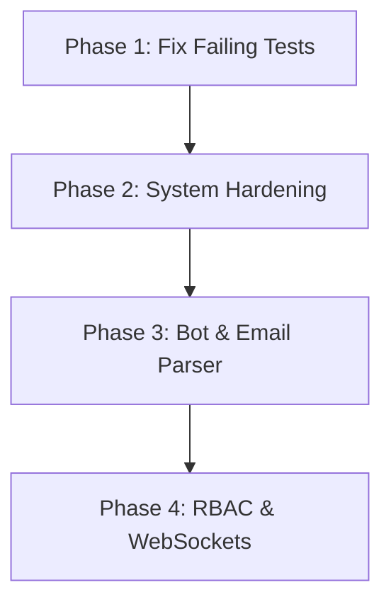

# Incomplete Tasks Implementation Plan

This document establishes the step-by-step roadmap for implementing all remaining incomplete tasks in the AI Pharmacy codebase. The roadmap has been fully aligned and verified to prevent regressions.

---

## 📅 Roadmap Overview

---

## 🛠️ Phases in Detail

### **Phase 1: Fix Legacy Sales Parser Tests (Codebase Stabilization)**
*   **Goal**: Resolve the timeouts and logic mapping errors in `salesParser.test.ts`.
*   **Approach**: Use an isolated test database setup per test block and ensure cache resets (`invoiceCache`, `inventoryCache`) between test runs.

### **Phase 2: System Hardening & Security Updates**
*   **Goal**: Resolve the 15 moderate/high/critical security vulnerabilities.
*   **Approach**:
    1.  Run `npm audit fix` for minor patches.
    2.  Carefully update major packages (such as `express` or `sqlite`) one-by-one.
    3.  Execute integration tests after each upgrade to catch regressions.

### **Phase 3: Telegram Bot & Email Parser Enhancements**
*   **Goal**: Implement OCR parsing for scanned invoices/PDFs, administrative bot controls, message queuing, and rich markdown formatting.
*   **Approach**: Process OCR tasks asynchronously via worker threads or queue processes, saving parsed results back to the database, and updating the UI via notifications.

### **Phase 4: Core System Features (RBAC & WebSockets)**
*   **Goal**: Implement Role-Based Access Control and real-time inventory updates.
*   **Approach**: Integrate a lightweight `ws` (WebSocket) server attached directly to the existing Express server, broadcasting stock changes on database update events.
