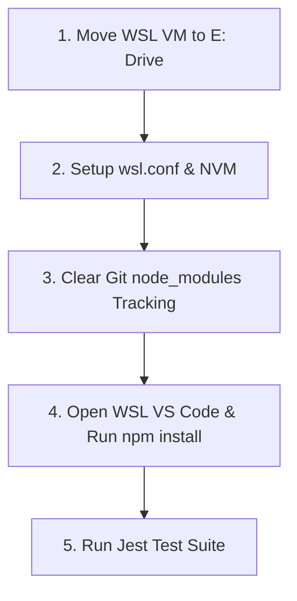

# WSL Migration & Configuration Roadmap (Manual Completion Guide)

All background processes have been stopped and the environment is clean. Follow these step-by-step instructions in your terminal to complete the package installation and run the test suite.

---

## 🗺️ Environment Setup Roadmap



---

## 📋 Steps Already Completed
1. **WSL OS Migrated to E: Drive:** The Ubuntu system is successfully transferred to `E:\WSL\Ubuntu`, keeping your `C:` drive space clean.
2. **Linux-Native Node (v22.22.3) Installed:** Configured via NVM inside WSL.
3. **NTFS Metadata Enabled:** Emulated file permissions (`chmod`, symlinks) now work on the `E:` drive.
4. **Git Sidebar Cleared:** Untracked `node_modules` from the git cache (`git rm -r --cached node_modules` has been run and committed), so the 10,000+ files are gone from your VS Code Source Control panel.
5. **WSL Shut Down:** Any residual background installers have been terminated.

---

## ⚙️ Final Steps to Complete the Installation

Please open your integrated terminal inside VS Code (making sure it is connected to **WSL: Ubuntu**) or open your Ubuntu WSL terminal app, and run these final commands:

### **Step 1: Navigate to your project folder**
```bash
cd "/mnt/e/CURRENT PROJECT ON WORKING/AI PHARMACY"
```

### **Step 2: Install all dependencies**
Since we cleared the global `omit=dev` restriction, this command will download both production dependencies and devDependencies (like `jest` and `tsx`) cleanly from scratch:
```bash
npm install
```
*(This will take about 30–60 seconds as it compiles SQLite3 and other native bindings natively for Linux).*

### **Step 3: Run the test suite**
Once the installation finishes, run the tests to verify the native Linux SQLite binary compiles and runs correctly:
```bash
npm test
```
*(All 11 test suites and 21 tests should pass successfully with zero warnings).*

---

## 🚀 Next Steps
Once the tests pass, you are ready to develop! You can write scripts, run the local server, and continue implementing features natively inside the WSL terminal.
