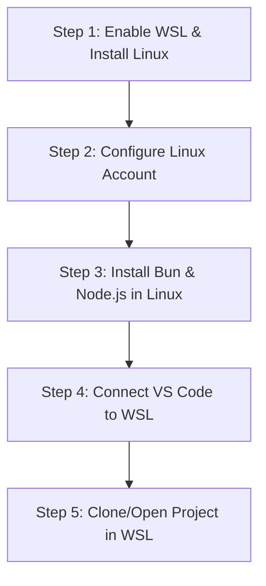

# WSL Setup & Linux Environment Integration Roadmap

This roadmap outlines the exact steps to enable WSL, configure a native Linux environment, install Bun, and connect VS Code for seamless agent workflows.

---

## 🗺️ Implementation Roadmap



---

## 📋 Step-by-Step Guide

### **Step 1: Enable WSL & Install Ubuntu**
1. Open Windows PowerShell as **Administrator**.
2. Run the installation command:
   ```powershell
   wsl --install
   ```
3. Restart your computer when prompted.

---

### **Step 2: Configure the Linux User Account**
1. After restarting, a Linux console window (Ubuntu) will open automatically.
2. Enter a new UNIX username and password.
3. Keep the terminal open for the next step.

---

### **Step 3: Install Node.js, Git, and Bun inside Linux**
Inside the Ubuntu terminal, run the following commands to install build essentials and runtime dependencies:

1. **Update package lists**:
   ```bash
   sudo apt update && sudo apt upgrade -y
   ```
2. **Install Node.js (via NodeSource LTS)**:
   ```bash
   curl -fsSL https://deb.nodesource.com/setup_20.x | sudo -E bash -
   sudo apt-get install -y nodejs build-essential
   ```
3. **Install Bun natively**:
   ```bash
   curl -fsSL https://bun.sh/install | bash
   source ~/.bashrc
   ```
4. **Verify installations**:
   ```bash
   node -v
   bun -v
   ```

---

### **Step 4: Connect VS Code to WSL**
1. Open VS Code on Windows.
2. Go to the Extensions view (`Ctrl+Shift+X`) and search for **WSL** (by Microsoft). Click **Install**.
3. Once installed, click the green icon in the bottom-left corner of VS Code, or open the Command Palette (`Ctrl+Shift+P`) and select:
   `WSL: Connect to WSL`

---

### **Step 5: Access the Project inside the WSL environment**
1. Inside the VS Code WSL window, open a terminal (`Ctrl+` ` `).
2. Navigate to your project folder using the `/mnt/` mount path (WSL automatically mounts Windows drives):
   ```bash
   cd /mnt/e/CURRENT\ PROJECT\ ON\ WORKING/AI\ PHARMACY
   ```
3. Run project installation:
   ```bash
   npm install
   ```
4. Now, all shell commands, tests, and plugin hooks will execute natively in a pure Linux shell context.

1. Open the Project in VS Code WSL
In your Ubuntu terminal, run the following command to open the exact project folder in VS Code WSL:

bash
code "/mnt/e/CURRENT PROJECT ON WORKING/AI PHARMACY"
(This will open a new VS Code window target pointing directly to the project folder on your Windows E: drive, but running in a WSL context).

2. Install Project Dependencies
Open the integrated terminal in your new VS Code WSL window (Ctrl + ~) and run:

bash
bun install
Once this is done, your environment is fully configured and ready for development!